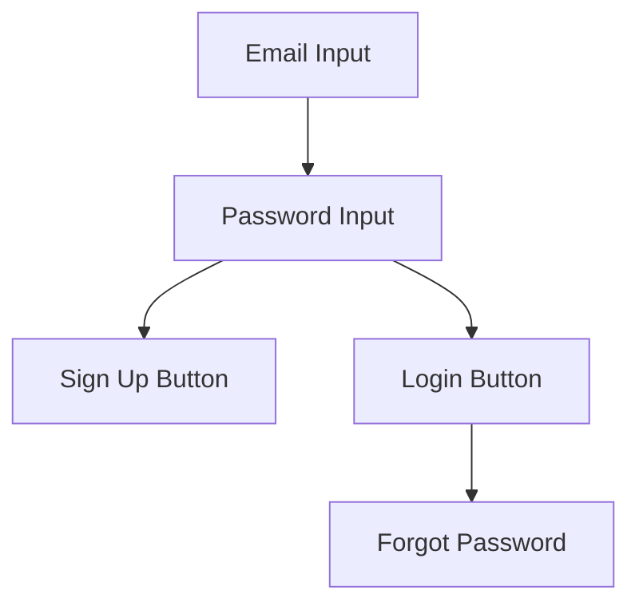
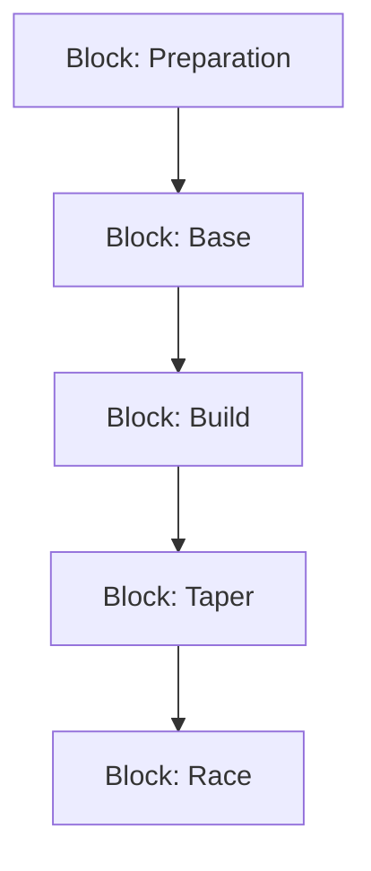

# AI Training Plan Generator – Requirements

## Purpose
A web app that generates and dynamically updates personalized training plans for running, cycling, or triathlon using an LLM. The app adapts plans based on user input, goal events, and actual training data.

---

## Key Features

1. **User Authentication**
   - Users must log in or sign up to access the app.
   - Authentication is required before any personal or training data is stored.

2. **User Data Collection (Profile)**
   - Profile data (sport, skill level, thresholds, goal race/event, goal date, preferred long/strength days, etc.) is collected when the user chooses to start a training plan, not at registration.

3. **Macrocycle (Overall Plan) Generation**
   - When a user sets a goal date/event, the system generates a high-level timeline (macrocycle) divided into blocks/phases (e.g., Preparation, Base, Build, Taper, Race).
   - Each block has a name, start/end date, and focus.
   - As the user completes a block, the next is generated. The user always knows their current phase and what’s next.

4. **Microcycle (Block/Workout) Generation**
   - Each block (typically 4 weeks: 3 build, 1 recovery) contains detailed daily workouts.
   - Workouts include sport, description, expected duration, warmup, main set, cooldown, and intensity zones.
   - **Calendar view displays each week as 7 days, with each day's workout(s) shown.**

5. **Dynamic Plan Updates**
   - Users can import or connect fitness data (e.g., Strava, Garmin, TrainingPeaks).
   - The system analyzes actual vs. planned training and updates upcoming workouts accordingly (e.g., adjusts for over/undertraining).

6. **User Progress Tracking**
   - Timeline view of macrocycle blocks/phases.
   - Calendar view of microcycle workouts (week view: 7 days, each with its workouts).
   - Current phase/block and upcoming phases always visible.

---

## Tech Stack

- **Frontend:** React, Material-UI/Chakra UI, FullCalendar/React Big Calendar, Context/Redux
- **Backend:** FastAPI (Python), PostgreSQL, SQLAlchemy/Tortoise ORM, OpenAI API, Celery/Background Tasks
- **Auth:** JWT/Auth0/Firebase Auth
- **Fitness Data Integration:** Strava API, Garmin Connect, TrainingPeaks API, file upload (.fit, .tcx, .csv)
- **Deployment:** Docker, AWS/GCP/Azure/Render

---

## Data Model (Simplified)

- **User**: id, name, email, password_hash, etc.
- **Profile**: user_id, sport, skill_level, thresholds, goal, goal_date, long_days, strength_days, etc. (collected when starting a plan)
- **OverallPlan (Macrocycle)**: user_id, goal_date, blocks[] (name, start_date, end_date, focus)
- **Block (Microcycle)**: id, user_id, start_date, end_date, block_type, workouts[]
- **Workout**: id, block_id, date, sport, title, description, expected_duration, intensity, warmup, main_set, cooldown, actual_data (optional)

---

## High-Level Flow

1. User registers/logs in.
2. User chooses to start a training plan and fills out profile data.
3. User sets a goal event/date.
4. System generates macrocycle (overall plan) with blocks/phases.
5. For each block, system generates detailed microcycle (workouts).
6. User views macrocycle timeline and microcycle calendar (week view: 7 days, each with its workouts).
7. User imports/links training data; system dynamically updates plan as needed.
8. As blocks complete, new blocks are generated and user is notified of progress.

---

## LLM Prompting Strategy
- Initial prompt includes all user data and goal for macrocycle and microcycle generation.
- Update prompt includes recent actual workout data and requests LLM to adjust next few days’ workouts.

---

## Example Macrocycle Output
```json
[
  {"name": "Preparation", "start": "2024-06-01", "end": "2024-06-14", "focus": "Build basic endurance and consistency"},
  {"name": "Base", "start": "2024-06-15", "end": "2024-07-12", "focus": "Increase aerobic capacity and volume"},
  {"name": "Build", "start": "2024-07-13", "end": "2024-08-09", "focus": "Add intensity and race-specific workouts"},
  {"name": "Taper", "start": "2024-08-10", "end": "2024-08-16", "focus": "Reduce volume, maintain intensity, freshen up"},
  {"name": "Race", "start": "2024-08-17", "end": "2024-08-17", "focus": "Goal event"}
]
``` 

---

## UI Wireframes (Mermaid Diagrams)

### App Flow
```mermaid
flowchart TD
    A1[Login/Sign Up Form] --> A2[Dashboard]
    A2 --> A3[Start Training Plan Button]
    A3 --> A4[User Profile Form (on plan start)]
    A4 --> A5[Macrocycle Timeline]
    A5 --> A6[Microcycle Calendar (Week View)]
    A6 --> A7[Workout Detail Modal]
    A6 --> A8[Data Import/Connect]
```

### Login/Sign Up Form


### User Profile Form (on plan start)
```mermaid
flowchart TD
    P1[Sport Dropdown] --> P2[Skill Level Selector]
    P2 --> P3[Threshold Inputs]
    P3 --> P4[Goal Race/Event]
    P4 --> P5[Goal Date Picker]
    P5 --> P6[Preferred Days (Long/Strength)]
```

### Macrocycle Timeline


### Microcycle Calendar (Week View)
```mermaid
flowchart TD
    W1[Week 1] --> W1d1[Mon] --> W1w1[Workout(s)]
    W1 --> W1d2[Tue] --> W1w2[Workout(s)]
    W1 --> W1d3[Wed] --> W1w3[Workout(s)]
    W1 --> W1d4[Thu] --> W1w4[Workout(s)]
    W1 --> W1d5[Fri] --> W1w5[Workout(s)]
    W1 --> W1d6[Sat] --> W1w6[Workout(s)]
    W1 --> W1d7[Sun] --> W1w7[Workout(s)]
    W2[Week 2] --> W2d1[Mon]
    W2 --> W2d2[Tue]
    W2 --> W2d3[Wed]
    W2 --> W2d4[Thu]
    W2 --> W2d5[Fri]
    W2 --> W2d6[Sat]
    W2 --> W2d7[Sun]
    W3[Week 3] --> W3d1[Mon]
    W3 --> W3d2[Tue]
    W3 --> W3d3[Wed]
    W3 --> W3d4[Thu]
    W3 --> W3d5[Fri]
    W3 --> W3d6[Sat]
    W3 --> W3d7[Sun]
    W4[Week 4] --> W4d1[Mon]
    W4 --> W4d2[Tue]
    W4 --> W4d3[Wed]
    W4 --> W4d4[Thu]
    W4 --> W4d5[Fri]
    W4 --> W4d6[Sat]
    W4 --> W4d7[Sun]
```

### Workout Detail Modal
```mermaid
flowchart TD
    E1[Sport] --> E2[Description] --> E3[Expected Duration] --> E4[Intensity/Zone] --> E5[Warmup] --> E6[Main Set] --> E7[Cooldown] --> E8[Actual Data (if available)]
``` 